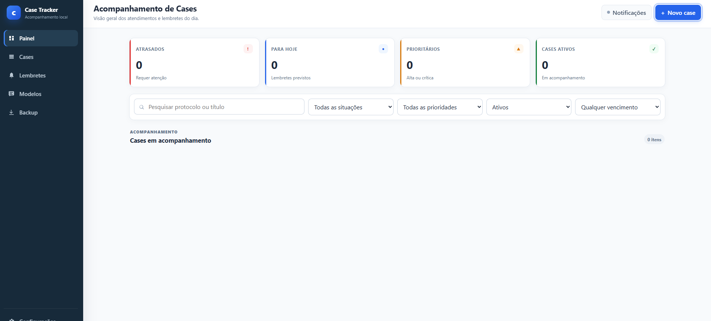
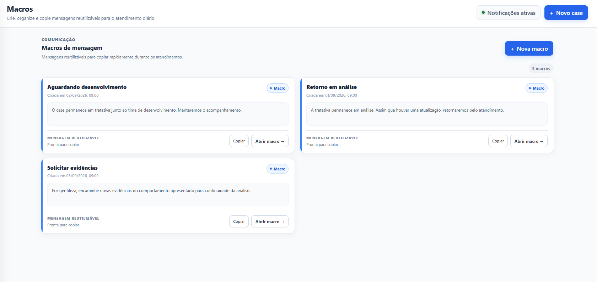

<p align="center">
  
</p>

<h1 align="center">Case Tracker</h1>

<p align="center">
  <strong>Acompanhamento local de cases, lembretes, macros, anotações e consultas SQL.</strong>
</p>

<p align="center">
  
  
  
  
</p>

<p align="center">
  
  
  
  
</p>

<p align="center">
  <a href="#-principais-recursos">Recursos</a> •
  <a href="#-interface">Interface</a> •
  <a href="#-instalação">Instalação</a> •
  <a href="#-lembretes">Lembretes</a> •
  <a href="#-backups">Backups</a> •
  <a href="#-desenvolvimento">Desenvolvimento</a>
</p>

---

## 📌 Sobre o projeto

O **Case Tracker** é uma aplicação local para organizar e acompanhar demandas. O sistema roda no navegador por meio de um servidor local em `localhost:8765` e mantém os dados operacionais no **IndexedDB** do perfil do navegador.

> [!IMPORTANT]
> O Case Tracker funciona como ferramenta pessoal de acompanhamento e apoio operacional.

---

## ✨ Principais recursos

| | Recurso | Descrição |
|---|---|---|
| 🗂️ | **Cases** | Cadastro manual com situação, prioridade, mensagem, observações e lembretes. |
| ⏰ | **Lembretes** | Horários com recorrência **Seg a sex** ou **Todos os dias**. |
| 🔔 | **Notificações** | Alertas pelo navegador e agente local do Windows. |
| 🔎 | **Pesquisa global** | Busca rápida com `Ctrl+K`, filtros e favoritos. |
| 🚀 | **GMUD** | Fila dedicada para cases aguardando mudança. |
| 📝 | **Rascunhos** | Salvamento automático com retenção de 1 dia. |
| 💬 | **Macros** | Mensagens reutilizáveis, pesquisáveis e com favoritos. |
| 📎 | **Anotações** | Conteúdo pesquisável com imagens e PDFs locais. |
| 🧩 | **Queries SQL** | Biblioteca com descrição, tags, favoritos, cópia e exportação `.sql`. |
| 🗑️ | **Lixeira** | Retenção de 7 dias antes da exclusão definitiva. |
| 🌗 | **Tema** | Interface clara e escura. |
| 💾 | **Backups** | Automático, manual e backup separado de anexos. |
| 🧰 | **Instalação local** | Atalho, inicialização em segundo plano e desinstalação sem privilégios administrativos. |

---

## 🖥️ Interface

> As capturas abaixo utilizam **dados fictícios de demonstração**.

### Painel de acompanhamento

<p align="center">
  
</p>

O painel destaca rapidamente **atrasos**, **lembretes do dia**, **prioridades** e **cases ativos**, além de disponibilizar filtros e pesquisa para a rotina de acompanhamento.

### Macros de mensagem

<p align="center">
  
</p>

As macros permitem salvar respostas recorrentes, pesquisar conteúdo, favoritar mensagens e copiar textos diretamente para o atendimento.

---

## 🧱 Como funciona

```text
Usuário
   ↓
Navegador padrão
   ↓
http://localhost:8765
   ↓
Case Tracker
   ├── IndexedDB        → dados operacionais
   ├── Service Worker   → cache da interface
   ├── PowerShell       → servidor local / agente / backups
   └── Windows          → atalhos e notificações locais
```

Não há backend remoto de negócio e o Case Tracker não envia os dados dos cases para serviços externos.

---

## ✅ Requisitos

| Requisito | Necessário |
|---|---|
| Windows | **10 ou 11** |
| PowerShell | **Windows PowerShell 5.1** |
| Navegador | Chromium ou outro navegador padrão compatível |
| Porta local | `8765` disponível |
| Permissão administrativa | **Não** |
| Node.js / npm | **Não** |

---

## 📦 Instalação

1. Baixe e extraia o pacote completo.
2. Execute **`INSTALAR_CASE_TRACKER.vbs`**.
3. O instalador copia os arquivos para `%LOCALAPPDATA%\CaseTracker`.
4. Um atalho **Case Tracker** é criado na Área de Trabalho e no Menu Iniciar.
5. Escolha se deseja abrir o sistema ao final da instalação.

O servidor é executado em segundo plano, sem manter uma janela de CMD ou PowerShell aberta.

> [!TIP]
> Após a instalação, utilize o **atalho Case Tracker** para abrir o sistema. Não é necessário iniciar manualmente o PowerShell.

---

## 🔄 Atualização

Antes de atualizar, gere um **backup manual** e, caso existam anexos importantes, um **backup de anexos**.

Depois:

1. encerre o Case Tracker;
2. extraia a nova versão;
3. execute `INSTALAR_CASE_TRACKER.vbs` novamente.

O IndexedDB pertence à origem `localhost:8765` e **não é apagado pelo instalador**.

---

## ⏰ Lembretes

Cada horário pode possuir sua própria recorrência:

| Recorrência | Comportamento |
|---|---|
| 🗓️ **Seg a sex** | Ignora sábado e domingo. |
| 📅 **Todos os dias** | Inclui sábado e domingo. |

O adiamento de uma ocorrência respeita a recorrência configurada no horário original.

Quando o agente local está ativo, ele verifica lembretes periodicamente e pode emitir alertas do Windows mesmo com as guias do Case Tracker fechadas.

Em **Configurações → Agente em segundo plano** é possível consultar o status e enviar um alerta de teste.

---

## 💾 Persistência e dados locais

Os dados principais são armazenados no **IndexedDB do navegador**.

- ✅ Fechar a guia ou o navegador não apaga os dados.
- ✅ Limpar apenas imagens/arquivos em cache normalmente não remove o IndexedDB.
- ⚠️ Limpar **dados do site**, IndexedDB ou armazenamento de `localhost:8765` pode apagar os dados locais.
- 💾 Antes de qualquer limpeza do navegador, faça backup.

> [!WARNING]
> Não utilize a limpeza completa dos dados de `localhost:8765` sem possuir um backup atualizado.

---

## 💿 Backups

O servidor local mantém os arquivos em:

```text
%LOCALAPPDATA%\CaseTracker\Backups
```

Estrutura:

```text
Backups\
├── Automaticos\backup-automatico.json
├── Manuais\backup-manual-<data>.json
├── Macros\macros-historico.json
├── Anotacoes\anotacoes-historico.json
└── Anexos\<data-hora>\
    ├── manifest.json
    └── <arquivos>
```

### Política de retenção

| Tipo | Retenção |
|---|---|
| 🔄 Backup automático geral | 1 cópia, atualizada em ciclo de 48h |
| 💾 Backup manual | até 30 dias |
| 📎 Backup de anexos | 3 cópias completas mais recentes |
| ⚠️ Backup interrompido de anexos | limpeza após 24h |
| 💬 Histórico de macros | acumulativo |
| 📝 Histórico de anotações | acumulativo |

Imagens e PDFs ativos permanecem no IndexedDB enquanto o registro associado existir. A limpeza de backups não remove anexos ativos.

---

## ⏹️ Encerramento

Use **Encerrar** no menu lateral para finalizar:

- servidor local;
- agente de lembretes;
- ciclos e timers da página;
- recursos temporários da sessão.

Após o encerramento, a guia mostra a tela de aplicação finalizada. Para iniciar novamente, feche a guia e utilize o atalho **Case Tracker**.

---

## 🧹 Desinstalação

Utilize **`DESINSTALAR_CASE_TRACKER.vbs`** ou a entrada **Desinstalar Case Tracker** no Menu Iniciar.

A rotina interna fica em `scripts\DESINSTALADOR_INTERNO.ps1` e não precisa ser executada manualmente.

O desinstalador:

- encerra servidor e agente;
- remove atalhos;
- remove `%LOCALAPPDATA%\CaseTracker`;
- preserva backups existentes em `Documentos\CaseTracker Backups\Desinstalacao-<data>`;
- **não apaga automaticamente o IndexedDB do navegador**.

---

## 🗃️ Estrutura do projeto

```text
case-tracker-mvp/
├── .github/
│   └── workflows/
│       └── validate.yml
├── docs/
│   └── screenshots/
├── icons/
├── scripts/
│   └── DESINSTALADOR_INTERNO.ps1
├── src/
│   ├── app.js
│   ├── attachments.js
│   ├── backup.js
│   ├── constants.js
│   ├── db.js
│   ├── domain.js
│   ├── notifications.js
│   ├── time.js
│   └── validation.js
├── ABRIR_CASE_TRACKER.vbs
├── CONFIGURAR_CASE_TRACKER.ps1
├── DESINSTALAR_CASE_TRACKER.vbs
├── index.html
├── INSTALAR_CASE_TRACKER.vbs
├── manifest.webmanifest
├── servidor-local.ps1
├── styles-v1.9.0-RC4.8.css
├── sw.js
└── theme-init.js
```

### Organização interna

| Arquivo | Responsabilidade |
|---|---|
| `src/app.js` | Interface e coordenação dos fluxos. |
| `src/domain.js` | Regras de negócio. |
| `src/db.js` | IndexedDB e transações. |
| `src/validation.js` | Validação e normalização. |
| `src/time.js` | Fuso horário e recorrência. |
| `src/notifications.js` | Notifications API. |
| `src/backup.js` | Backup e restauração. |
| `src/attachments.js` | Imagens/PDFs locais. |
| `servidor-local.ps1` | Servidor loopback, agente e backups. |

---

## 🔐 Segurança e privacidade

- 🔒 O servidor escuta somente em **loopback**, não na rede local.
- 🔑 Endpoints administrativos utilizam token de sessão.
- 🛡️ As respostas HTTP incluem CSP e cabeçalhos básicos de proteção.
- 🚫 Não são utilizadas dependências JavaScript remotas em tempo de execução.
- 📡 O Case Tracker não possui telemetria própria.
- ⚠️ Evite cadastrar senhas, tokens, credenciais ou dados pessoais desnecessários.


## 🛠️ Desenvolvimento

O Case Tracker utiliza **JavaScript ES6 nativo**, sem etapa de build e sem dependências npm.

Ao contribuir ou modificar o projeto:

1. mantenha regras de negócio em `src/domain.js`;
2. mantenha o acesso ao IndexedDB em `src/db.js`;
3. preserve o fuso `America/Sao_Paulo` nas regras de agenda;
4. atualize `CACHE_NAME` em `sw.js` quando houver alteração de assets em uma nova release;

<p align="center">
  <strong>Case Tracker</strong><br>
  Organização local para não deixar nenhuma demanda sem acompanhamento.
</p>
